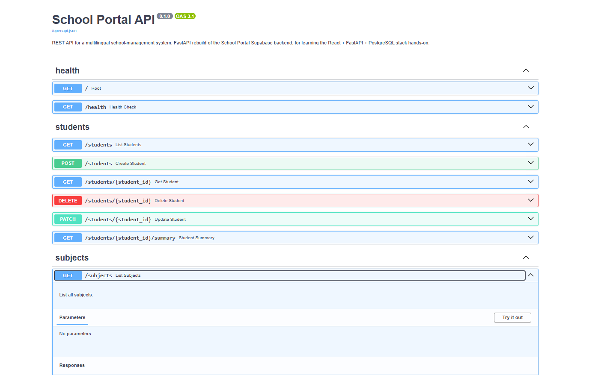

<h1 align="center">Mini-Gradebook · API</h1>
<p align="center">FastAPI + SQLAlchemy + PostgreSQL backend for a full-stack school-gradebook app.</p>

<p align="center">
  <a href="https://gradebook.alekseilopatin.com"></a>
  <a href="https://github.com/AlekseiLopatin/school-portal-api/actions/workflows/tests.yml"></a>
  
  
  
  
  
</p>

<p align="center">
  
</p>

## About

This is the backend for **Mini-Gradebook** — a full-stack rebuild of the [School Portal](https://github.com/AlekseiLopatin/school-website) API layer in React + FastAPI + PostgreSQL, designed as a hands-on learning project for the modern Python web stack. Same domain (students, subjects, grades), rebuilt from scratch.

Powers the React frontend at **[gradebook.alekseilopatin.com](https://gradebook.alekseilopatin.com)**. Interactive API docs are auto-generated by FastAPI from type hints and live at the backend's `/docs` endpoint.

## Features

- **JWT authentication** — `/auth/login` issues a bearer token against a hashed password in the `users` table; all write routes require it
- **Type-hint-driven REST API** — function signatures *are* the API contract; Swagger docs at `/docs` are generated automatically
- **Pydantic v2 schemas** — request and response validation at the boundary, separate Create / Read / Update shapes
- **SQLAlchemy 2.0 ORM** — four related tables (students, subjects, grades, users) with foreign keys and cascade rules
- **Dependency-injected DB sessions** — `get_db()` opens a session per request and closes it after the response, even on exceptions
- **Computed endpoints** — e.g. `/students/{id}/summary` returns per-subject averages via a single GROUP BY query, no N+1
- **Environment-aware database** — SQLite for local dev (zero setup), managed PostgreSQL on Railway in production; auto-detected at runtime
- **CI on every push** — GitHub Actions runs the full pytest suite (unit + integration + auth) on push/PR to `main`

## Endpoints

Write routes (`POST` / `PATCH` / `DELETE`) require `Authorization: Bearer <token>`. Read routes (`GET`) are public.

| Method | Path | Auth | What it does |
|---|---|---|---|
| `POST` | `/auth/login` | — | Exchange username + password for a JWT |
| `GET` | `/students` | public | List all students |
| `POST` | `/students` | 🔒 | Create a student |
| `GET` | `/students/{id}` | public | One student |
| `PATCH` | `/students/{id}` | 🔒 | Partial update — only fields you send change |
| `DELETE` | `/students/{id}` | 🔒 | Delete (cascades to grades) |
| `GET` | `/students/{id}/summary?semester=` | public | Average score per subject for a student |
| `GET` | `/subjects` | public | List all subjects |
| `POST` | `/subjects` | 🔒 | Create a subject |
| `GET` | `/grades?student_id=&subject_id=&semester=` | public | List grades, filterable |
| `POST` | `/grades` | 🔒 | Record a grade |

## Tech stack

| Layer | Technology |
|---|---|
| Framework | FastAPI |
| Language | Python 3.11+ |
| ORM | SQLAlchemy 2.0 |
| Validation | Pydantic v2 |
| Auth | JWT (`python-jose`) + bcrypt password hashing (`passlib`) |
| Database (dev) | SQLite — single file, zero setup |
| Database (prod) | PostgreSQL — managed by Railway |
| API docs | Swagger UI (built into FastAPI) at `/docs` |
| CI | GitHub Actions — pytest on every push/PR to `main` |
| Hosting | Railway |

## Quick start

```bash
# 1. Create and activate a virtual environment
python -m venv .venv
source .venv/bin/activate            # macOS / Linux
# .venv\Scripts\Activate.ps1         # Windows PowerShell

# 2. Install dependencies
pip install -r requirements.txt

# 3. Seed the one admin account (there is no public registration endpoint)
ADMIN_USERNAME=youruser ADMIN_PASSWORD='choose-a-real-one' python seed_admin.py

# 4. Run the dev server
uvicorn main:app --reload

# 5. Open the interactive API docs
# http://localhost:8000/docs

# 6. Run the test suite
pytest -v
```

For production, set the `DATABASE_URL` environment variable to a PostgreSQL connection string and `SECRET_KEY` to a long random value (the JWT signing key — the fallback in `auth.py` is dev-only and insecure). The app auto-detects sqlite vs postgres and adjusts engine arguments accordingly. CORS allowed origins are configured in `main.py` — include your frontend's deployment URL there.

## Data model

Four tables, deliberately small:

```sql
students:  id, name, grade_level
subjects:  id, name (unique)
grades:    id, student_id (FK), subject_id (FK), score (0–100), semester, created_at
users:     id, username (unique), hashed_password
```

`Base.metadata.create_all(bind=engine)` creates the tables on startup. For a larger project, swap this for Alembic migrations.

## Project structure

```
.
├── main.py              # FastAPI app: router registration, table creation, CORS
├── database.py          # SQLAlchemy engine + session dependency (`get_db`)
├── models.py            # SQLAlchemy ORM models
├── schemas.py           # Pydantic schemas — Base / Create / Read patterns
├── crud.py              # Database operations — the service layer
├── auth.py              # Password hashing, JWT issuance/decode, get_current_user
├── seed_admin.py        # One-time script to create the admin user
├── routers/
│   ├── auth.py          # /auth/login
│   ├── students.py      # /students endpoints
│   ├── subjects.py      # /subjects endpoints
│   └── grades.py        # /grades endpoints
├── tests/               # pytest suite — unit (crud), integration (routes), auth
├── .github/workflows/   # CI: pytest on every push/PR
├── requirements.txt
├── Procfile             # Railway start command
└── README.md
```

## Related repos

- **[school-portal-frontend](https://github.com/AlekseiLopatin/school-portal-frontend)** — the React + TypeScript frontend that consumes this API
- **[school-website](https://github.com/AlekseiLopatin/school-website)** — the original School Portal (Next.js + Supabase) whose API layer this rebuilds

## Roadmap

- [x] Auth — JWT-based authentication and protected routes
- [ ] Alembic migrations (replace `Base.metadata.create_all`)
- [ ] Pagination on list endpoints
- [ ] Background tasks — e.g. recompute averages on grade write
- [ ] Rate limiting

## License

MIT — see [LICENSE](LICENSE).